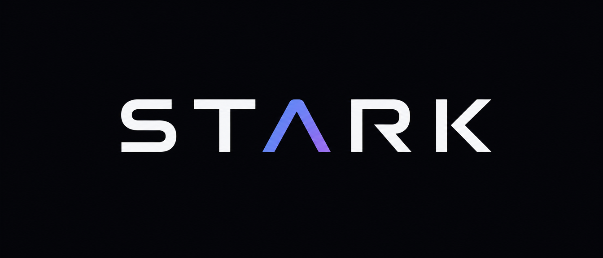

<p align="center">
  
</p>

<p align="center">
  <b>Una GUI per gli agent AI che scrivono codice.</b><br>
  Gira sulla tua macchina, si apre nel browser, e sostituisce il terminale invece di imitarlo.
</p>

---

## Che problema risolve

Claude Code e simili si usano dal terminale, e funzionano bene. L'interfaccia però è un
flusso di testo che scorre: tutto ha lo stesso aspetto, niente si può richiudere, e ciò che
è passato è passato. **Tredici scambi di lavoro reale producono circa quattrocento blocchi**
fra testo, ragionamenti e operazioni. Dentro quel muro non si capisce più cosa è stato fatto,
quali file sono stati toccati, né quali domande sono state fatte e cosa si è risposto.

E soprattutto: non si lavora con un agent alla volta. Se ne lanciano tre o quattro in
parallelo su progetti diversi, e li si sorveglia — chi ha finito, chi è fermo ad aspettare
una risposta, chi sta ancora lavorando. Dal terminale quella sorveglianza si fa a mano,
girando fra le finestre.

STARK è un **cruscotto dei lavori in corso**, non un'app di messaggistica: la conversazione
è un sottoprodotto, quello che conta è lo stato del lavoro — e cambia proprio mentre sei
girato dall'altra parte.

> **Il principio fondante.** STARK non è un terminale nel browser: è una GUI che
> **sostituisce** la TUI. Ogni volta che una scelta tecnica costringe a «simulare il
> terminale», è la scelta sbagliata.

Il corollario che ne governa il perimetro: **STARK non deve mai poter meno del CLI.** Se il
CLI lo consente, STARK lo consente. Se il CLI lo rifiuta, la voce si mostra disabilitata
**con la spiegazione**, mai nascosta.

## Com'è fatto

```
 agent (Claude Code, via Agent SDK)
      │  messaggi nella forma dell'agent
      ▼
 adapter ──► eventi canonici ──► journal JSONL ──► reduce ──► stato
      │      l'unico punto che        append-only      funzione pura
      │      nomina Claude Code                        eventi → schermo
      ▼
 daemon: HTTP + SSE su 127.0.0.1 ──► UI nel browser (Svelte)
```

Due cose reggono tutto il resto:

- **Il vocabolario canonico.** Fuori dall'adapter nessun componente sa che esiste Claude
  Code. È quel confine a rendere possibile un secondo agent senza rifare la UI.
- **L'invariante del journal.** Lo stato dello schermo dev'essere ricostruibile *interamente*
  rileggendo il journal dall'inizio. Se la UI tenesse anche un solo dato che non nasce da lì,
  il risveglio di una sessione dormiente mostrerebbe mezzo schermo vuoto — e nessuno se ne
  accorgerebbe fino a quel momento. `core/reduce.ts` è quell'invariante resa eseguibile, e la
  UI nel browser usa **la stessa funzione** del daemon.

Il modello di eventi sta in [`docs/event-model.md`](docs/event-model.md): è il contratto fra
motore e interfaccia, e si legge prima di toccare l'uno o l'altra.

## Stato

Motore completo e funzionante: sessione vera sopra l'**Agent SDK ufficiale**, traduzione nel
vocabolario canonico, permessi in modalità `auto` con zero interruzioni, domande a scelta
multipla, journal, Sleep, risveglio con `--resume`, import di conversazioni nate nella CLI, e
il daemon con il suo perimetro di sicurezza.

**La UI legge e scrive.** Elenco dei lavori agganciato a un flusso globale, conversazione dal
vivo con turni richiudibili, casella di scrittura e Stop, permessi e domande nel blocco in
basso, effetti nelle due letture con il confronto affiancato, modello e modalità che cambiano
a caldo, nuova chat, import di conversazioni dal terminale, risveglio, rinomina, sleep,
elimina. Restano fuori le **impostazioni** e le **notifiche di sistema**.

Il disegno di tutte le schermate, con il perché di ogni scelta, sta in
[`docs/ui-schermate.md`](docs/ui-schermate.md) e nell'anteprima
[`docs/ui-anteprima.html`](docs/ui-anteprima.html).

## Requisiti

Node **≥ 22.18**. Claude Code **non** va installato a parte: l'SDK porta il proprio
eseguibile, appaiato alla propria versione dal lockfile. I sorgenti TypeScript girano
direttamente (`node src/….ts`), senza build — è da 22.18 che l'esecuzione dei `.ts` è attiva
senza flag. `tsc` resta necessario per il controllo dei tipi, che lo stripping **non** fa.

```
npm install
npm run ui:build      # la UI è servita dal daemon, va compilata una volta
npm run stark:start   # daemon staccato: sopravvive alla chiusura del terminale
```

L'indirizzo stampato contiene il token una volta sola. Al primo caricamento STARK lo sposta
in un cookie e lo toglie dalla barra degli indirizzi.

**L'indirizzo è sempre lo stesso** — `http://127.0.0.1:4571` — e il token **non cambia più a
ogni avvio**: si può tenere una scheda aperta, che dopo un riavvio del daemon si ricollega da
sola. Il motivo non è la comodità: quando il daemon muore, muoiono con lui i processi degli
agent, e riaprire una conversazione rilegge tutto il contesto — cioè **costa quota**.

| | |
|---|---|
| `npm run stark:start` | lo avvia **staccato**: chiudere il terminale non lo tocca |
| `npm run stark:status` | se è vivo, dove, e quante conversazioni ha |
| `npm run stark:stop` | lo ferma con garbo: gli agent si chiudono e i journal restano coerenti |
| `npm run stark` | in primo piano, per guardarlo lavorare. Ctrl-C lo ferma |
| `npm run stark:token -- --new` | ne fa uno nuovo, se il vecchio è finito dove non doveva |

## Comandi

| | |
|---|---|
| `npm run stark` | il daemon in primo piano (staccato: `stark:start`, vedi sopra) |
| `npm run ui:dev` | la UI con ricarica a caldo, in parallelo al daemon |
| `npm run ui:build` | compila la UI in `ui/dist`, che è ciò che il daemon serve |
| `npm run check` | catena completa su eventi finti: 76 verifiche, **zero quota spesa** |
| `npm run typecheck` · `npm run ui:check` | controllo dei tipi, motore e UI |
| `npm run slice` | sessione Claude Code vera, poi Sleep, poi replay del journal |
| `npm run resume` | prova il risveglio: spegne la sessione e verifica che il modello ricordi |
| `npm run takeover` | cosa succede con due processi sulla stessa sessione |
| `npm run import -- <trascritto.jsonl>` | apre in STARK una conversazione nata nella CLI |
| `npm run daemon` | prova il daemon da capo a fondo: 24 verifiche, perimetro compreso |
| `npm run diff` | fa modificare un file davvero e disegna il confronto affiancato |
| `npm run queue` | manda due prompt ravvicinati e verifica che restino due turni, in fila |
| `npm run icons` · `python3 tools/gen-logo.py` | rigenerano icone e marchio dalle sorgenti |

`npm run check` è quello da eseguire spesso: la risorsa scarsa è la quota, non i dollari, e
un test che costa un turno di modello è un test che nessuno esegue.

### Variabili per `npm run slice`

| | |
|---|---|
| `STARK_MODEL` | default `claude-sonnet-5`. Con un modello che non regge auto mode la sessione riparte in Manual e la fetta lo segnala. |
| `STARK_MODE` | default `auto` |
| `STARK_ASK` | tool per cui chiedere il permesso, separati da virgola. Vuoto = zero interruzioni. `STARK_ASK=Bash` mostra il comportamento voluto: `Write` ed `Edit` passano dal classificatore, solo `Bash` torna indietro. |
| `STARK_PROMPT` | il prompt da mandare |

## Sicurezza

STARK esegue comandi arbitrari, e sulla macchina di sviluppo lo fa **come root**. La
sicurezza qui è un requisito, non un accorgimento.

Un server su localhost **non** è al sicuro per il fatto di essere su localhost: qualunque
pagina web tu abbia aperta può mandargli richieste. Le difese sono quattro e coprono attacchi
diversi:

- **indirizzo** — si ascolta esplicitamente su `127.0.0.1`, non su tutte le interfacce
- **`Host`** — ferma il DNS rebinding, cioè un dominio dell'attaccante che punta a `127.0.0.1`.
  È l'unica cosa che il browser non lascia falsificare, ed è per questo che regge
- **`Origin`** — ferma le richieste che arrivano da un altro sito
- **token** in `Authorization: Bearer` o in un cookie `SameSite=Strict`, confrontato a tempo
  costante — distingue STARK da qualunque altro processo sulla macchina

Nessuna intestazione CORS, di proposito.

**Il token sta su disco**, in `~/.stark/token` con permessi `0600`, e non cambia più a ogni
avvio: senza, un daemon che sopravvive al terminale cambierebbe indirizzo ogni volta e nessuna
scheda aperta funzionerebbe due volte. Il costo va detto: è un segreto a riposo. Sta accanto ai
journal, che nella stessa cartella contengono già tutto ciò che l'agent ha letto — chi può
leggere il token può già leggere quelli. `npm run stark:token -- --new` ne fa uno nuovo.

Distinzione che vale la pena tenere ferma: questi controlli **non** limitano ciò che puoi
fare. Limitano *chi altro* può guidare l'agent. Il CLI non ne ha bisogno perché non ha
superficie di rete; una web app quella protezione implicita la perde, e il token la
restituisce.

## Dove finiscono le conversazioni

In `~/.stark/sessioni/`, **fuori dal repo**. Un journal importato contiene la conversazione
intera, compreso tutto ciò che l'agent ha letto: sta fuori da git per costruzione, non per
una riga di `.gitignore` che qualcuno può cancellare per sbaglio.

Riprendere una sessione richiede il trascritto dell'agent, quindi STARK non usa
`--no-session-persistence`. Il journal di STARK ricostruisce lo schermo; il contesto del
modello vive nel trascritto dell'agent. Sono due memorie diverse e servono entrambe.

## Dove stanno le decisioni

Le motivazioni, gli ADR e la roadmap **non stanno in questo repo**: stanno su Notion, e i
collegamenti sono in [`CLAUDE.md`](CLAUDE.md). Qui c'è il codice e le specifiche che cambiano
insieme al codice — il modello di eventi e il disegno delle schermate.

Ogni decisione strutturale è registrata come ADR **con la motivazione**, così che se un
domani la si rimette in discussione si sappia su quali premesse era stata presa.

## Crediti

Marchio in `docs/logo/`. `stark-wordmark.svg` è vettorizzato dall'originale e usa
`currentColor`: la stessa immagine sta bene sul chiaro e sullo scuro, senza varianti da
tenere allineate. Icone: [Lucide](https://lucide.dev), licenza ISC. Caratteri: IBM Plex Sans
e IBM Plex Mono, licenza OFL.
